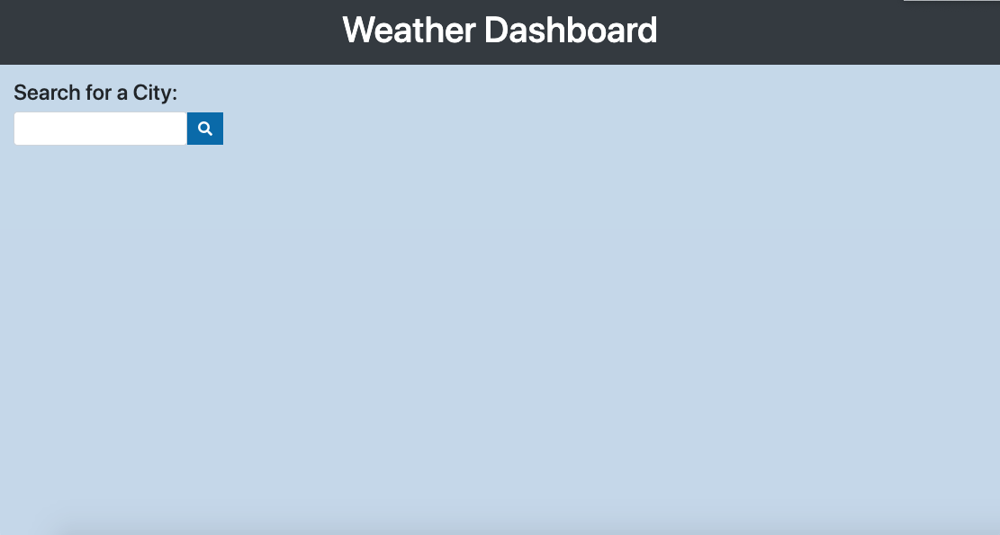
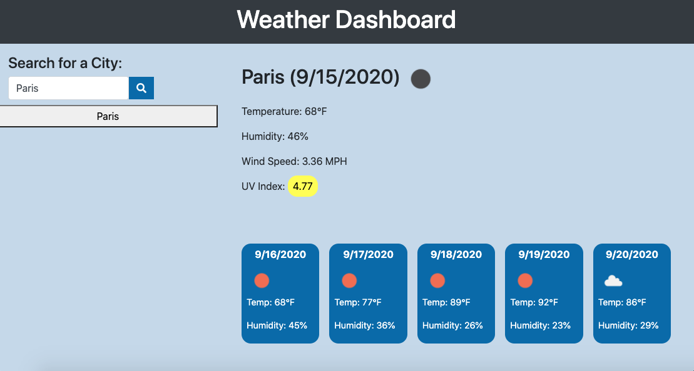

# Weather-Dashboard332

## Description

In this project, I have created a weather dashboard where the user can enter the name of a city in the search bar and receive the current weather as well as the 5-day forecast. This application uses OpenWeather API to retrieve the information and stores the last searched city in local storage. It runs in the browser and features dynamically updated HTML and CSS.

## Table of Contents

- [Installation](#installation)
- [Usage](#usage)
- [Credits](#credits)
- [License](#license)

## Installation

Click this link in order to use the weather dashboard:
https://cgriffin332.github.io/Weather-Dashboard332/

## Usage

When the webpage loads, the user is presented with an empty weather dashboard and a search input.

When the user submits a search city they are presented with the current weather conditions including city name, the date, an icon representation of weather conditions, the temperature, the humidity, the wind speed, and the UV index. The background-color of the UV Index represents the level of severity including Green(low), Yellow(moderate), Orange(high), Red(very high), and Violet(extreme). The user is also presented with the 5-day forecast that displays the date, an icon representation of weather conditions, the temperature, and the humidity.

Each time the user searches a new city, it appears underneath the search-bar and becomes their search history.

When the user clicks on one of the cities in their search history, that city's weather information is displayed onto the page.

If the user refreshes the page, their search history will be removed, but they will be presented with the last searched city forecast.

## Credits

This project was assigned to me by my Georgia Tech Bootcamp. I used jQuery, Bootstrap, Moment.js, OpenWeather API, Ajax, and Font Awesome to help power the site.

## Contact
Calvin Griffin  
Email: cgriffin332@gmail.com  
LinkedIn: https://www.linkedin.com/in/calvin-griffin-8247521b7/  
Portfolio: https://cgriffin332.github.io/Updated-Portfolio332/

## License

MIT License

Copyright (c) [2020] [Calvin Griffin]

Permission is hereby granted, free of charge, to any person obtaining a copy
of this software and associated documentation files (the "Software"), to deal
in the Software without restriction, including without limitation the rights
to use, copy, modify, merge, publish, distribute, sublicense, and/or sell
copies of the Software, and to permit persons to whom the Software is
furnished to do so, subject to the following conditions:

The above copyright notice and this permission notice shall be included in all
copies or substantial portions of the Software.

THE SOFTWARE IS PROVIDED "AS IS", WITHOUT WARRANTY OF ANY KIND, EXPRESS OR
IMPLIED, INCLUDING BUT NOT LIMITED TO THE WARRANTIES OF MERCHANTABILITY,
FITNESS FOR A PARTICULAR PURPOSE AND NONINFRINGEMENT. IN NO EVENT SHALL THE
AUTHORS OR COPYRIGHT HOLDERS BE LIABLE FOR ANY CLAIM, DAMAGES OR OTHER
LIABILITY, WHETHER IN AN ACTION OF CONTRACT, TORT OR OTHERWISE, ARISING FROM,
OUT OF OR IN CONNECTION WITH THE SOFTWARE OR THE USE OR OTHER DEALINGS IN THE
SOFTWARE.

---
